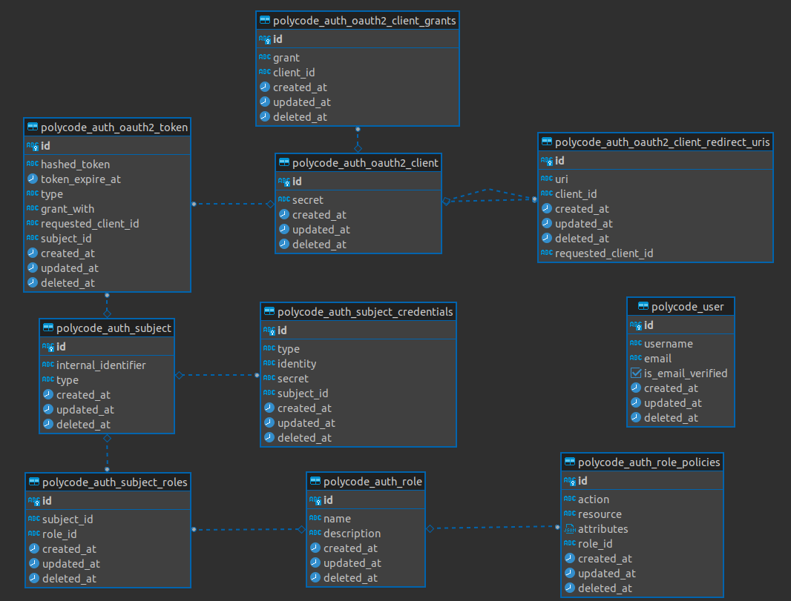
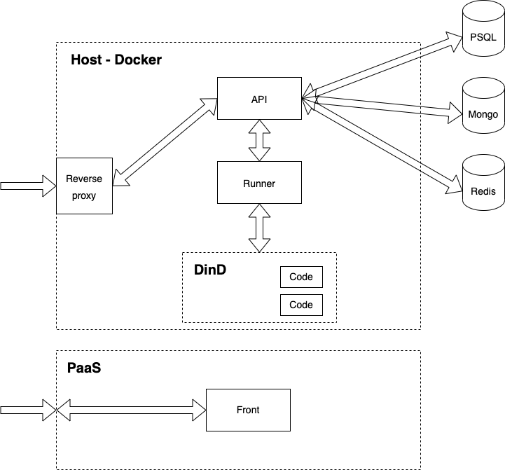

# Technical Architecture Document (TAD)

## Overview

> The coding interview cracking platform

### Observations

- More and more students have to “crack code interviews”
- To be efficient, students need to train, exercise and practice code interviews

**We need a platform that...**

- Allows students to practice with katas, exercises, etc.
- Allows to share some knowledge around technologies and make hands-on/tutorials available around it
- Allows students to pass assessments and certifications

### Philosophy

#### Authentification & Authorization

I've implemented the OAuth2 protocol for the authentification because OAuth2 is a standard specification used by the most largest companies and in the future we will be able to provide our authentification for validating some certification in Linked for example.

Authorization is role-based with policies like IAM on AWS. User are linked to some roles, and role giving some permissions in the application (like reading user data, submit solution). I use that implementation because by default any action is prohibited and only allowed actions can be performed.

#### Challenges

A challenge can be a course, module or an exercise. Basically, a course includes modules and modules includes exercises.
To validate a module, all the exercises must be completed. Same thing for courses.

## Technical choices

### Back-end

- Monolith application
- Typescript & ES 2022+
- Mono-repo with [Nx](https://nx.dev)
- Based on [Express](https://expressjs.com) with [NestJS](http://nestjs.com) framework
- PostgresSQl, Mongo and Redis as databases
- JWT Authentification
- Email sending with [AWS SES](https://aws.amazon.com/en/ses/)

I've created a monolith Typescript application, as requested by the requirements, in a mono repo because it's easier to manage dependencies.
Nx provides tools to build, test, lint mono repo based applications with a lot of plugins and the cli.
Nx allows to run build, test and lint the entire project (including applications and libraries) witch is really useful.

Switch to PostgreSQL, I've used it to manage the user data and all the authentification process because the relational aspect is great for that part.

There is the SQL schema :

MongoDB are used to store the challenges and user submissions. Challenges will be subject to significant modeling changes and the documentary databases are very suitable for this kind of thing.

Redis are only used to store temporary data such as token for email validation.

### Runner

- Included in the back-end repository
- Typescript & ES 2022+
- Based on [Express](https://expressjs.com) with [NestJS](http://nestjs.com) framework
- Use container with [Docker](https://www.docker.com)

I've chosen to use containers with Docker because it's easier to isolate code execution from each others and for security reasons.
Managing the code execution process's lifecycle, and retrieving stdout and stderr are simple thanks to the Docker API.

The code source provided by the user is passed to the container through an environment variable.
The code source is write inside a file inside the `/tmp` path and executed.
The result from stdout and stderr are written to the stdout with prefix (I've used that solution to avoid `attach` instruction from Docker because in some case, mostly network latency some line were lost)

### Front-end

- React
- Typescript & ES 2022+
- [MUI](http://mui.com)
- Monaco Editor

I've created a Single Page Application (SPA) with React and Typescript, as requested by the requirements, for the front-end.
I've used MUI because it's provided a lot of styled components with logical (onClick, Grid ...) and it's decrease the development time.
I've tried React-Ace for the code editor, but I found that Monaco is a way much easier to use, provide auto-completion and have a nice look.

## Deployment choices

I've decided to use Docker to deploy the application instead of Kubernetes because I ran out of time (I'll talk about this later) so I had to deploy the application quickly and Docker with Docker-compose simplify the process.
I've also decided to use Docker-in-docker as the docker host for the runner application for security reasons.

The deployment is simple, start a reverse proxy on the front of the host, redirect `api.polycode` to the api application, launch a Docker-in-Docker container and finally launch the runner-service with a link to the Docker-in-Docker container with Docker API exposed over TCP inside the docker network.

I've used a PaaS call [Vercel](http://vercel.com) to deploy the front-end because they provide edge locations to deploy the static files with low latency over the world.

## Post mortem

I've excepted some troubles to manage my time for some reasons (lot of fatigue, a lot of things to do at work and no motivation for the project [hope that will be better on the future])
That's why I'm not really happy with the code and especially with the front-end.
This project learned me some new concepts like mono repo application, overview of NestJS, running code inside a container.
